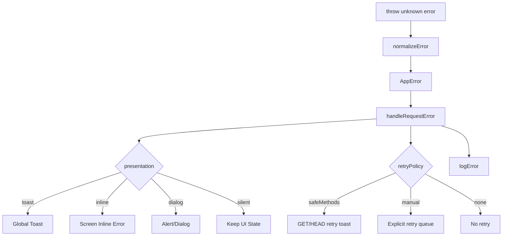
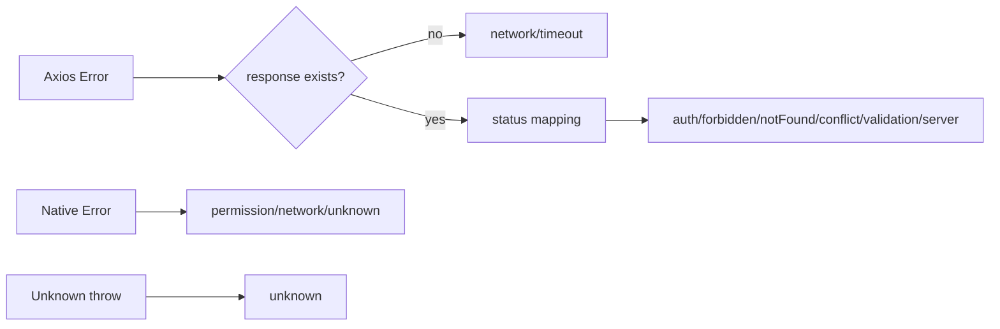
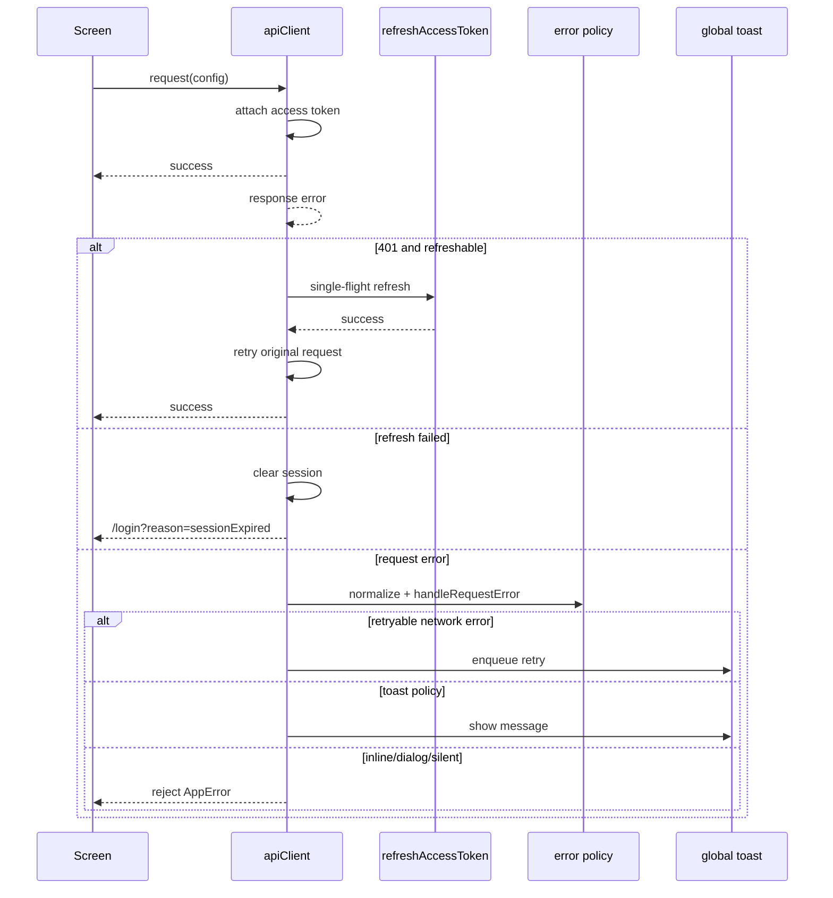
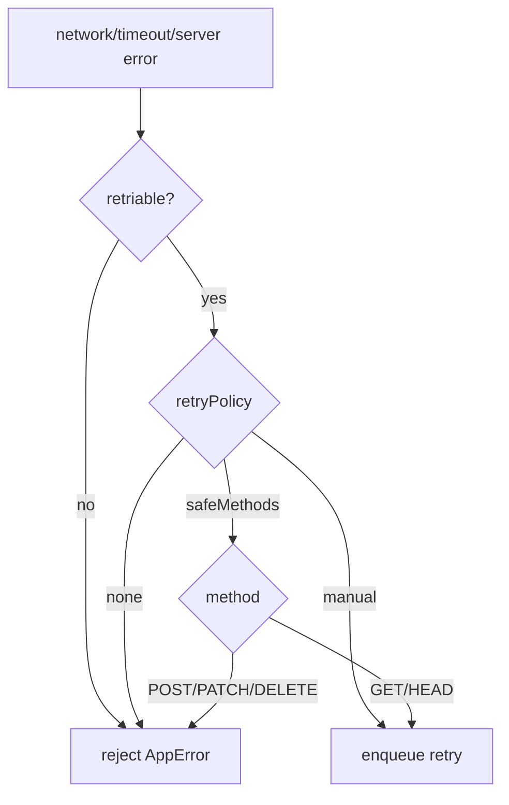
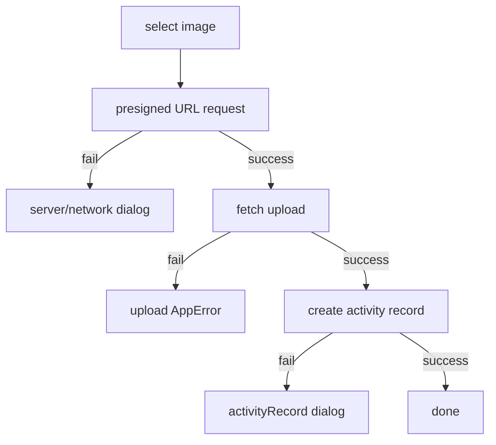
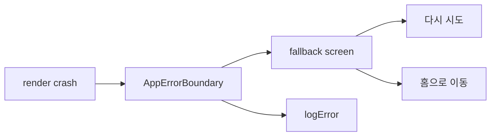
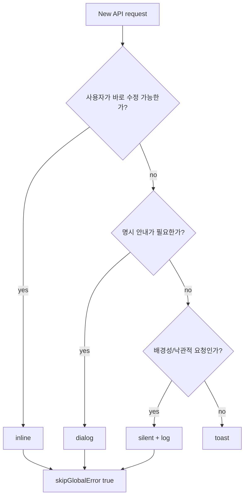

# 에러 핸들링 설계 및 적용 문서

## 목적

디톡스메이트 FE의 에러 처리는 API 요청 실패, 네트워크 장애, 인증 만료, 업로드 실패, 권한 실패, 렌더링 크래시를 한 흐름으로 다루기 위해 표준화했다.

핵심 방향은 다음과 같다.

- 에러를 먼저 `AppError`로 정규화한다.
- 정규화된 에러를 기준으로 사용자 노출 방식과 재시도 정책을 결정한다.
- 서버 `message`를 그대로 노출하지 않고 프론트 문구 매핑을 우선한다.
- 전역 처리와 화면별 처리를 분리해 중복 toast를 막는다.
- 외부 관측 도구 없이 내부 `logError` 추상화까지만 둔다.

## 전체 구조



## 계층 설계

### 1. Error Model

위치: `src/api/errors/types.ts`, `src/api/errors/normalizeError.ts`

모든 에러는 최종적으로 `AppError`로 변환된다.

```ts
type AppError = Error & {
  isAppError: true;
  type: AppErrorType;
  status?: number;
  code?: string;
  payload?: ApiErrorPayload;
  originalError?: unknown;
  retriable?: boolean;
};
```

`type`은 화면 정책과 사용자 문구를 결정하는 기준이다.

| type         | 의미                       |
| ------------ | -------------------------- |
| `network`    | 네트워크 연결 실패         |
| `timeout`    | 요청 시간 초과             |
| `auth`       | 인증 실패 또는 세션 만료   |
| `forbidden`  | 접근 권한 없음             |
| `notFound`   | 리소스 없음                |
| `conflict`   | 충돌 상태                  |
| `validation` | 입력값 또는 요청 형식 오류 |
| `server`     | 5xx 서버 장애              |
| `upload`     | 이미지 업로드 실패         |
| `permission` | 네이티브 권한 실패         |
| `unknown`    | 분류 불가                  |

### 2. Normalization

위치: `src/api/errors/normalizeError.ts`

`normalizeError(error)`는 Axios, fetch/native Error, unknown throw를 모두 `AppError`로 변환한다.



HTTP status 매핑은 다음 기준을 따른다.

| status   | AppError type |
| -------- | ------------- |
| 401      | `auth`        |
| 403      | `forbidden`   |
| 404      | `notFound`    |
| 409      | `conflict`    |
| 400, 422 | `validation`  |
| 500 이상 | `server`      |
| 그 외    | `unknown`     |

## 요청 처리 흐름

위치: `src/api/client.ts`

Axios interceptor는 다음 책임만 가진다.

1. access token 첨부
2. 401 발생 시 single-flight refresh
3. refresh 실패 시 세션 정리 후 로그인 이동
4. 요청 에러 정규화
5. 전역 toast/retry/logging 정책 실행



## 정책 모델

위치: `src/api/errors/types.ts`, `src/api/errors/handleRequestError.ts`

요청별 정책은 `AxiosRequestConfig`에 직접 실어 보낸다.

```ts
customAxios({
  url: '/groups/join',
  method: 'POST',
  data: { inviteCode },
  errorPolicy: {
    presentation: 'inline',
    messagesByStatus: {
      404: '초대 코드를 다시 확인해주세요',
      409: '초대 코드를 다시 확인해주세요',
    },
  },
  retryPolicy: 'none',
  skipGlobalError: true,
});
```

### Presentation

| presentation | 사용처                                                      |
| ------------ | ----------------------------------------------------------- |
| `toast`      | 전역 안내가 적합한 장애                                     |
| `inline`     | 입력값, 초대 코드처럼 화면 안에서 바로 수정 가능한 오류     |
| `dialog`     | 업로드/게시 실패처럼 사용자가 명시적으로 인지해야 하는 오류 |
| `silent`     | 낙관적 mutation, 배경성 요청, 기존 UI 유지가 더 나은 오류   |

기본값은 다음과 같다.

| AppError type | 기본 presentation |
| ------------- | ----------------- |
| `network`     | `toast`           |
| `timeout`     | `toast`           |
| `server`      | `toast`           |
| 그 외         | `silent`          |

### Retry Policy

위치: `src/api/errors/retryPolicy.ts`

| retryPolicy   | 의미                                     |
| ------------- | ---------------------------------------- |
| `safeMethods` | 기본값. `GET`, `HEAD`만 재시도 가능      |
| `manual`      | mutation이어도 명시적으로 재시도 큐 허용 |
| `none`        | 재시도하지 않음                          |



## 전역 UI 처리

위치: `src/stores/networkErrorToastStore.ts`

기존 `NetworkErrorToast` store를 전역 에러 toast 역할로 확장했다.

| 상태      | 역할                           |
| --------- | ------------------------------ |
| `pending` | 재시도 가능한 네트워크 요청 큐 |
| `message` | 재시도 없는 일반 전역 메시지   |
| `visible` | toast 표시 여부                |

전역 toast를 막는 조건은 다음과 같다.

- `skipGlobalError: true`
- `errorPolicy.presentation`이 `inline`, `dialog`, `silent`
- `skipAuthRefresh: true`

## 화면별 적용

### 로그인

로그인 실패는 OAuth/native/API 실패를 `normalizeError`로 정규화한다. 일반 로그인 실패 toast와 세션 만료 후 로그인 이동 정책을 유지한다.

### 그룹 생성/참여

위치: `src/screens/group/GroupCreateScreen.tsx`, `src/screens/group/GroupJoinScreen.tsx`

그룹 생성/참여는 `customAxios` 직접 호출로 요청 정책을 config에 넣는다.

| 화면                | 처리                           |
| ------------------- | ------------------------------ |
| 그룹 생성 `409`     | inline 문구                    |
| 그룹 참여 `404/409` | inline 문구                    |
| 그 외 실패          | 화면 fallback 문구             |
| 전역 toast          | `skipGlobalError: true`로 차단 |

### 인증 제출/이미지 업로드

위치: `src/lib/uploadImage.ts`, `src/features/activity-record/submitTotalUsageActivityRecord.ts`

업로드는 단계별 실패 원인을 분리한다.



### 피드

피드의 배경성 요청과 낙관적 mutation은 `silent + log` 정책을 사용한다. 실패하더라도 기존 UI 상태를 무분별하게 깨지 않고, 개발 환경에서 로그만 남긴다.

### 프로필 이미지 삭제

위치: `src/api/transformer.ts`, `src/screens/group/mypage/useProfileImageUpdater.ts`

프로필 이미지 삭제는 빈 문자열 대신 `null`을 전송한다. OpenAPI generated type도 `profileImageObjectKey?: string | null`이 되도록 transformer에서 nullable을 보정한다.

## 런타임 크래시 방어

위치: `app/_layout.tsx`, `src/components/AppErrorBoundary`

API/async 에러는 request error flow에서 처리하고, render-time crash는 Error Boundary가 처리한다.



## Orval 생성 전략

`customAxios`는 단일 `AxiosRequestConfig`만 받는다.

```ts
export const customAxios = async <T>(config: AxiosRequestConfig): Promise<T> => {
  const response = await apiClient(config);
  return response.data;
};
```

이 구조를 선택한 이유는 Orval axios generator가 mutator에 두 번째 인자가 있으면 각 generated 파일마다 다음 타입을 반복 생성하기 때문이다.

```ts
type SecondParameter<T extends (...args: never) => unknown> = Parameters<T>[1];
```

요청별 정책은 두 번째 `options`가 아니라 config에 직접 포함한다. 따라서 generated API는 간결하게 유지되고, 정책이 필요한 대표 화면은 wrapper 또는 `customAxios` 직접 호출로 처리한다.

## 적용 원칙

새 요청에 에러 정책을 붙일 때는 다음 순서로 결정한다.



기본 가이드:

- mutation은 기본적으로 자동 재시도하지 않는다.
- `GET/HEAD` 네트워크 실패만 전역 재시도 toast 대상이다.
- 화면에서 inline/dialog를 띄우면 전역 toast는 끈다.
- 서버 `message`는 디버깅 정보로만 보고 사용자 문구는 프론트 매핑을 우선한다.
- 개인정보, token, request body는 로그에 남기지 않는다.
