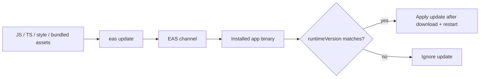
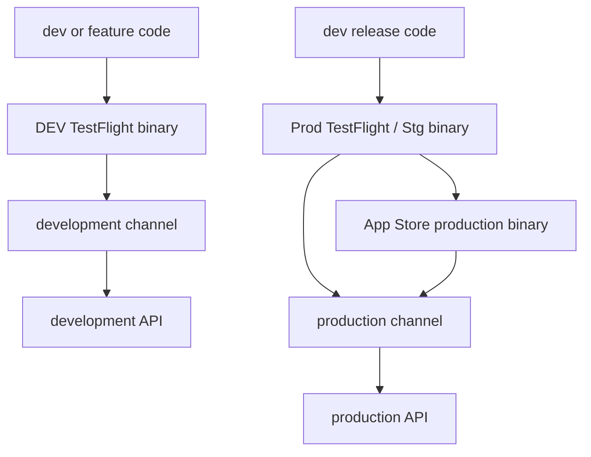
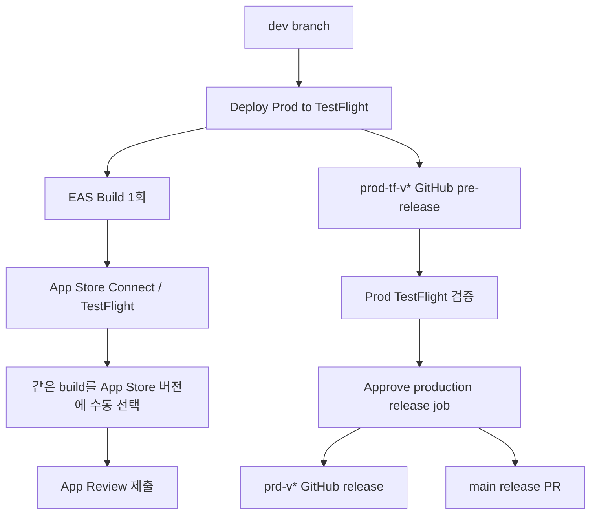
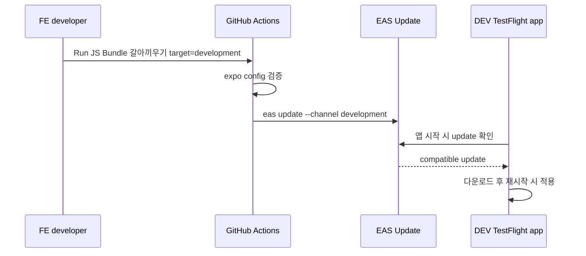
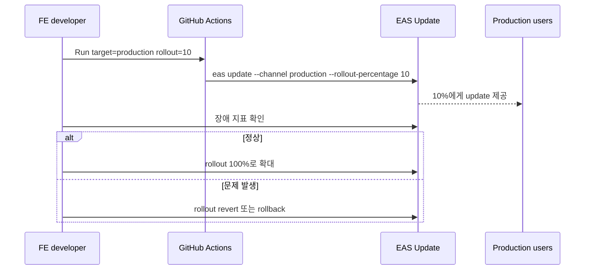

# JS Bundle 갈아끼우기 운영 가이드

이 문서는 프론트엔드 개발자가 EAS Build 없이 JS 변경분을 배포할 수 있도록, 현재 레포에 구성된 EAS Update 설정과 사용 방법을 정리한다.

## 현재 구성

EAS Update는 앱 바이너리에 포함된 native runtime 위에 JS bundle과 asset update를 교체하는 방식이다. 이 레포는 `appVersion`을 runtime 기준으로 사용한다.



핵심 설정은 다음과 같다.

- `app.config.ts`
  - `runtimeVersion: { policy: 'appVersion' }`
  - `updates.url: https://u.expo.dev/0387da46-8602-45c5-b927-229815033a44`
  - `updates.checkAutomatically: 'ON_LOAD'`
- `eas.json`
  - `development-store` -> `development` channel / `development` environment
  - `production` -> `production` channel / `production` environment
- `.github/workflows/swap-js-bundle.yml`
  - 수동 OTA 배포 workflow
  - production OTA는 `dev` 브랜치에서만 실행 가능
  - production은 기본 10% rollout으로 시작
  - native 영향 가능 파일이 변경되면 `eas update` 전에 실패

## 환경 매핑



| 용도                  | EAS profile         | App env       | EAS channel   | EAS environment | 비고           |
| --------------------- | ------------------- | ------------- | ------------- | --------------- | -------------- |
| DEV - TestFlight      | `development-store` | `development` | `development` | `development`   | dev API 사용   |
| Prod - TestFlight/Stg | `production`        | `production`  | `production`  | `production`    | 운영 후보 검증 |
| Prod - 운영           | `production`        | `production`  | `production`  | `production`    | App Store 운영 |

Prod TestFlight/Stg와 운영은 같은 `production` channel을 사용한다. 따라서 같은 `app_version`을 대상으로 한 OTA는 TestFlight와 App Store 운영 앱을 분리해서 보낼 수 없다. 운영 중인 버전의 핫픽스는 10% rollout으로 시작해서 검증한다.

## 사용 방법

### 1. 먼저 OTA가 가능한 변경인지 확인

OTA로 배포 가능한 변경:

- JS/TS 로직 변경
- 화면 문구, 스타일, 레이아웃 변경
- Metro bundle에 포함되는 일반 이미지 asset 변경
- API 호출 로직 변경

EAS Build가 필요한 변경:

- native dependency 추가/업데이트
- Expo SDK, React Native 버전 변경
- `app.config.ts`의 `ios`, `android`, `plugins`, `entitlements`, `infoPlist` 변경
- Firebase plist/json, Kakao native 설정 변경
- 앱 아이콘, splash 등 native resource 변경

애매하면 EAS Build가 필요한 변경으로 취급한다.

workflow도 이 기준을 보수적으로 검사한다. 다음 파일이 대상 변경분에 포함되면 OTA 배포는 실패한다.

- `app.config.*`, `eas.json`
- `package.json`, lockfile
- `ios/**`, `android/**`
- `modules/**`, `plugins/**`, `firebase/**`, `patches/**`
- `metro.config.*`, `babel.config.*`
- `assets/icon.png`, `assets/adaptive-icon.png`, `assets/splash_logo.png`

production은 `app_version`에 맞는 `prd-v<version>-*` tag부터 현재 HEAD까지 비교한다. development는 같은 tag가 있으면 그 tag를 쓰고, 없으면 `origin/dev`와 현재 HEAD를 비교한다.

### 2. 대상 runtime version 확인

OTA는 `APP_VERSION`이 같은 앱에만 적용된다.

예를 들어 운영 앱이 `1.0.3`이면 `app_version=1.0.3`으로 배포해야 한다. `1.0.4`로 배포한 update는 `1.0.3` 앱이 받지 않는다.

현재 production release version은 GitHub Release 태그 `prd-v<version>-<run>` 또는 App Store Connect/TestFlight 빌드 정보에서 확인한다.

### 3. GitHub Actions로 OTA 배포

GitHub Actions에서 `JS Bundle 갈아끼우기` workflow를 수동 실행한다.

입력값:

| 입력                 | 값                               | 설명                        |
| -------------------- | -------------------------------- | --------------------------- |
| `target`             | `development` 또는 `production`  | 배포할 EAS channel          |
| `app_version`        | 예: `1.0.3`                      | 대상 runtime/app version    |
| `message`            | 예: `hotfix: fix login redirect` | EAS dashboard에 남을 메시지 |
| `rollout_percentage` | `10`, `25`, `50`, `100`          | production rollout 비율     |

권장 사용:

- DEV 검증: `target=development`, `rollout_percentage=100`
- 운영 핫픽스 시작: `target=production`, `rollout_percentage=10`
- 운영 전체 확대: EAS dashboard 또는 `eas update:edit`으로 rollout을 100%로 변경

workflow는 내부적으로 다음 명령을 실행한다.

```bash
eas update \
  --channel "$TARGET" \
  --environment "$TARGET" \
  --message "$MESSAGE" \
  --non-interactive
```

native 변경 guard가 통과한 뒤에만 위 명령이 실행된다. production에서 `rollout_percentage`가 `100`이 아니면 `--rollout-percentage`가 추가된다.

## 배포 흐름

### Production binary 배포와 운영 승격

EAS Build 횟수를 아끼기 위해 production binary 배포는 TestFlight 검증과 운영 릴리즈 기록을 분리한다.



`Deploy Prod to TestFlight` workflow는 production profile로 새 binary를 빌드하고 App Store Connect/TestFlight에 업로드한다. 이때 `prod-tf-v<version>-<run>` pre-release를 만들고, release body에 app version, commit SHA, EAS build ID를 기록한다.

같은 workflow의 `Approve production release` job은 GitHub `production` environment approval에서 대기한다. TestFlight 검증이 끝나면 Actions 화면에서 이 job을 승인한다. 승인 후에는 새 `eas build`나 `eas submit`을 실행하지 않고, 같은 workflow에서 만든 EAS build metadata를 다시 검증한 뒤 `prd-v*` release와 main release PR만 만든다.

승인 버튼을 강제하려면 GitHub repository Settings > Environments에서 `production` environment를 만들고 Required reviewers를 설정해야 한다. 이 보호 규칙이 없으면 GitHub Actions가 environment job을 자동으로 진행할 수 있다.

승격 시점에 `dev` HEAD가 TestFlight build commit과 달라졌으면 workflow는 실패한다. 이 경우 최신 `dev`로 `Deploy Prod to TestFlight`를 다시 실행해 새 build를 검증한다.

App Store Connect에서 같은 TestFlight build를 App Store version에 선택하고 App Review에 제출하는 단계는 수동으로 진행한다.

### DEV TestFlight 검증



### 운영 핫픽스



## 장애 대응

rollout 중 문제가 있으면 rollout을 되돌린다.

```bash
eas update:revert-update-rollout
```

이미 100% 배포한 뒤 문제가 있으면 rollback한다.

```bash
eas update:rollback
```

rollback 후 수정본을 다시 배포할 때는 같은 `target`, 같은 `app_version`을 사용한다.

## 개발자 체크리스트

Prod TestFlight binary 배포 전:

- `Deploy Prod to TestFlight` workflow를 `dev` 브랜치에서 실행
- `version_bump` 또는 `custom_app_version`이 의도한 App Store version인지 확인
- 성공 후 생성된 `prod-tf-v*` pre-release와 EAS build ID 확인

Prod 운영 승격 전:

- TestFlight에서 production API 기준 주요 플로우 검증
- `Deploy Prod to TestFlight` workflow run의 `Approve production release` job 승인
- 승인 후 workflow가 새 EAS Build 없이 `prd-v*` release와 main release PR만 생성하는지 확인
- App Store Connect에서 같은 build를 App Store version에 선택하고 App Review 제출

OTA 배포 전:

- 변경 내용이 native 변경을 포함하지 않는지 확인
- 대상 `app_version` 확인
- production 배포는 `dev` 브랜치 기준인지 확인
- production 첫 배포는 `rollout_percentage=10` 사용

OTA 배포 후:

- EAS dashboard에서 update 생성 여부 확인
- 앱을 종료 후 다시 열어 update 적용 확인
- production rollout은 오류/크래시/주요 플로우를 확인한 뒤 확대
- 배포 메시지에 변경 목적을 명확히 남김

## 참고

- EAS Update는 기존에 배포된 바이너리에 소급 적용되지 않는다. OTA 설정이 포함된 새 바이너리가 TestFlight/App Store에 배포된 뒤부터 사용할 수 있다.
- 앱은 update를 다운로드한 뒤 다음 재시작 시 적용한다. 수동 확인 UI는 현재 구현되어 있지 않다.
- Expo 공식 문서: [EAS Update](https://docs.expo.dev/eas-update/getting-started/), [Runtime versions](https://docs.expo.dev/eas-update/runtime-versions/), [Rollouts](https://docs.expo.dev/eas-update/rollouts/), [Rollbacks](https://docs.expo.dev/eas-update/rollbacks/)
